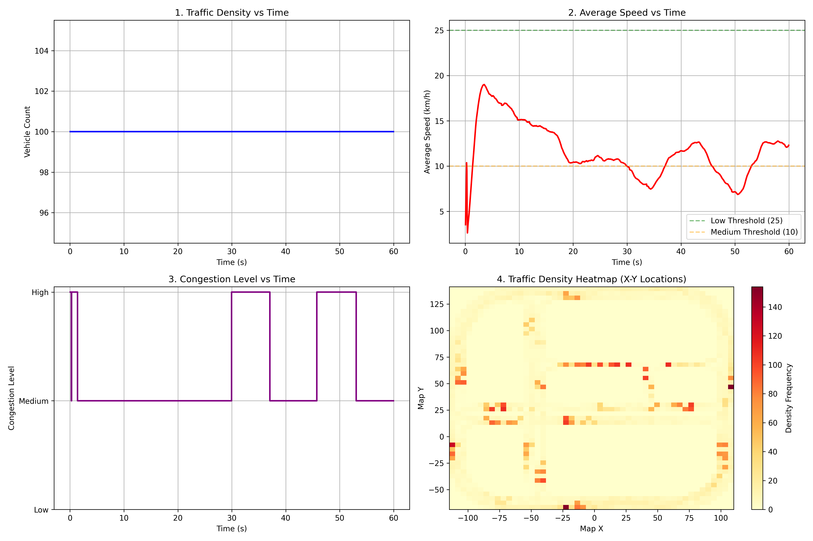

# 🚗 AI Traffic Flow Simulation System (CARLA + UE5)
An AI Traffic Flow Simulation &amp; Congestion Analysis System bases on Carla-UE5

## 📌 Overview

This project implements an AI-based traffic flow simulation system using the CARLA autonomous driving simulator.
It simulates real-world urban traffic conditions with multiple autonomous vehicles and performs data-driven congestion analysis.

The system automatically generates vehicles, enables autopilot driving, collects traffic data, and analyzes congestion patterns over time.

---

## 🎯 Features

* 🚘 Spawn and simulate 30–100 (depend on your device) autonomous vehicles
* 🤖 Automatic driving using CARLA Traffic Manager
* 📊 Real-time traffic data collection (speed, density)
* 🚦 Congestion detection based on average speed
* 📁 Export structured data to CSV
* 📈 Visualization of traffic metrics
* 🔥 Traffic density heatmap generation

---

## 🚗 Simulation Scene


*Figure: Multi-vehicle autonomous traffic simulation in urban environment*

## 📊 Results

### Traffic Analysis


---
## 🧠 Methodology

### 1. Traffic Simulation

* Vehicles are spawned randomly across map spawn points
* CARLA Traffic Manager controls autonomous driving behavior
* Simulation runs in synchronous mode for stable data collection

---

### 2. Data Collection

At each simulation step, the system records:

* Vehicle count (traffic density)
* Average speed (km/h)
* Vehicle positions (for heatmap)

Data is stored in:

```text
traffic_metrics.csv
```

---

### 3. Congestion Detection

Traffic congestion is determined based on average speed:

```python
if avg_speed > 25:
    congestion = "Low"
elif avg_speed > 10:
    congestion = "Medium"
else:
    congestion = "High"
```

---

### 4. Visualization

The system generates:

* 📈 Traffic Density vs Time
* 🚗 Average Speed vs Time
* 🚦 Congestion Level vs Time
* 🔥 Traffic Density Heatmap

All visualizations are saved as:

```text
traffic_analysis.png
```

---

## 🗂️ Project Structure

```text
City_driving_flow_SIM_Carla.py   # Main simulation script
traffic_metrics.csv & traffic_data.csv              # Output data
traffic_analysis.png             # Visualization results
```

---

## ⚙️ Requirements

* Python 3.8+
* CARLA (UE5 version)
* Required Python packages:

```bash
pip install matplotlib numpy
```

---

## ▶️ How to Run

### 1. Start CARLA

On Windows:

```powershell
.\CarlaUE5.exe -quality-level=Low
```

---

### 2. Run Simulation

```bash
python City_driving_flow_SIM_Carla.py
```

---

### 3. Output

After simulation (~60 seconds), the system will:

* Save traffic data to CSV
* Generate visualization plots
* Display analysis results

---

## 📊 Example Outputs

* Traffic density increases over time under high load
* Average speed decreases as congestion grows
* Heatmap highlights high-density regions

---

## 🚀 Future Improvements

* Adaptive traffic light control (reinforcement learning)
* Multi-intersection traffic optimization
* Real-time congestion prediction models
* Integration with deep learning models

---

## 💡 Notes

* Recommended to run with 20–50 vehicles for better performance
* High vehicle counts may cause CPU bottlenecks
* Works best in smaller maps (e.g., Town03)

---

## 📬 Author

* Built as part of a data science + simulation project
* Focused on intelligent transportation systems (ITS)
